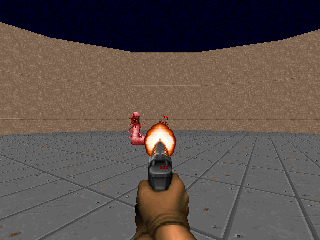
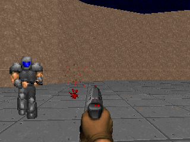

# WOLFE

**Weightless Ontological Language Function Engine**

> I solve problems.

A neural tool calling model. One C file. Zero pretrained parameters.

**WOLFE** can now remember your corrections and live inside your C program.

The model files are text. You can read them. You can edit them. WOLFE rebuilds
its numerical field from them when it starts. There is no checkpoint to download,
no training command to discover, and no API secretly doing the work.

Some problems need a billion parameters. Selecting one of your six functions
deserves the courtesy of trying something smaller first.

## Doom experiment

**WOLFE already plays Doom.** The same C engine chooses six primitive game
actions through typed function calls. Game outcomes select persistent example
corrections; WOLFE rebuilds its field from that memory for subsequent games.
The [Doom adapter](doom/README.md) supplies game-provided symbolic observations.
Multiplayer self-play remains unexplored.

Latest evaluation: **16 matched episodes per policy**, seeds 1501–1516.

| Result | Older reference | Retained player | Latest trial |
| --- | ---: | ---: | ---: |
| Kills | 17 | **99** | 99 |
| Deaths | 8 | **4** | 5 |
| Alive at the fixed horizon | 8 | **12** | 11 |

The older reference uses two acquired corrections and legacy perception;
the retained player uses four corrections and filtered perception. The latest
five-record trial failed its benefit gate, so the four-record player remains
the reference. These are results on one scenario, with at most 128 four-tic
calls per episode. Full comparisons and failed trials remain in the log.

| After 64 calls: five kills, health 100 | After 128 calls: eleven kills, health 30 |
| --- | --- |
|  |  |

New, unedited ViZDoom/Freedoom frames from the retained player, seed 1513.
This is one successful episode; the final frame reaches the fixed experiment
horizon, not completion of the game.
[Frame provenance](assets/doom/README.md) · [Experiment log](doom/WOLFEDOOMLOG.md).

## Run the wolf

```sh
cc -O2 -std=c99 wolfe.c -o wolfe -lm
./wolfe 'play music by Portishead'
```

The response includes:

```json
{"calls":[{"name":"play_music","arguments":{"query":"Portishead"}}],"status":"call","confidence":0.984372}
```

`confidence` is an activation score, **not a calibrated probability**. The engine
returns a decision; your application executes the tool.

The C body needs a C99 compiler, the C standard library and `libm`. The readable
Python body uses only the standard library:

```sh
python3 wolfe.py 'play music by Portishead'
```

Or keep the Python field loaded in your application:

```python
from wolfe import Wolfe

wolf = Wolfe("tools.json", "examples.jsonl")
result = wolf.call("play music by Portishead", reasoning=True)
```

## Your functions. Your language.

The starter surface has six ordinary functions:

| Tool | Arguments |
| --- | --- |
| `get_weather` | `city`, optional `unit` |
| `set_timer` | `seconds` |
| `cancel_timer` | none |
| `play_music` | `query` |
| `pause_music` | none |
| `create_note` | `text` |

`tools.json` describes the interface. `examples.jsonl` supplies phrases and
argument boundaries. For example:

```json
{"text":"play music by {query}","tool":"play_music","arguments":{"query":"{query}"}}
{"text":"do not play music","tool":null,"arguments":{}}
```

`{query}` is a span to copy, not a word the user must type. Include multiple ways
to express an action, near-neighbour actions, and examples that should cause no
call. Literal example arguments can supply values when the example matches.

Change those files and restart. No compiler or training step is involved in
changing the tool vocabulary. An unrelated interface is included:

```sh
./wolfe --tools examples/custom_tools.json \
        --examples examples/custom_examples.jsonl \
        'set kitchen lamp to 30'
```

It declares package delivery, room lighting and device power. The C source
contains none of these tool names.

The supported JSON Schema subset is deliberately small: flat object arguments
with `string`, `number`, `integer` and `boolean` properties; `required`, `enum`,
numeric `minimum`/`maximum`, and `default`. Only declared properties are emitted.
Nested objects, arrays, references, unions and unsupported constraints are
rejected. OpenAI-style `{"type":"function","function":{...}}` declarations
and `input_schema` are accepted as wrappers around this same subset.

Two optional schema extensions keep extraction declarative:

- `"x-unit":{"minute":60,"minutes":60}` converts quantities to a property's
  base unit.
- `"x-aliases":{"true":["on","enabled"],"false":["off","disabled"]}` maps
  phrases to boolean or enum values.

## neural part

The corpus constructs token vectors from signed lexical projections and
distance-weighted co-occurrence. These are the metaweights: numerical
connections derived from the supplied text.

Query tokens activate example units through content attention. Ordered token
pairs contribute predictive evidence — **prophecy**. Example activity excites
tool units. Those units feed back into the semantic context and settle through
six nonlinear recurrent steps with lateral inhibition — **destiny**. A no-call
unit competes alongside the functions.

Ordered subject/modal prefixes are compared with the supplied examples, so
"I listen" does not get the same evidence as "please play" just because both
mention music. The settled field selects the tool. Argument spans then compete
on their own evidence, including the option that a required value is missing.
Ordinary code validates and serializes them. A malformed brace is not a deep
thought.

Concrete argument values in construction examples are replaced by slots before
the field is built. An example containing a particular city or brightness does
not require the next request to use that same city or number.

There is no transformer hiding in the basement. WOLFE uses a small recurrent
associative network. Its tokenizer uses words and character-trigram similarity,
not BPE. Numerical coefficients are fixed algorithm constants; token vectors and
tool attractors are rebuilt from the definitions. Neither is gradient-trained.

PostGPT and Q are the ancestors, not dependencies. WOLFE borrows their
corpus-to-field idea and gives it a smaller output language. See
[the v2 engineering record](docs/V2_ENGINEERING.md) and
[the original field equations](docs/ENGINEERING.md).

## Reasoning you can point at

Off by default. Two ways to turn it on:

```sh
./wolfe --reasoning-compact 'play music by Portishead'
./wolfe --reasoning 'play music by Portishead'
```

Compact mode shows the winning function, matched words, argument values and
sources, and the winning margin. Here the evidence is `play`, `music`, `by`;
`Portishead` comes from input bytes `[14,24]`. Full mode adds all tool candidates,
related examples, ordered-pair evidence, the activation trajectory, and competing
argument scores. Absent required arguments have their own diagnostics.

These are computed observations. No extra model writes a story about them.
Both options leave the selected call unchanged. Span offsets are UTF-8 **bytes**.
In Python use `reasoning="compact"` or `reasoning=True`.

## State with a job

Normal inference does not write anything. You can explicitly correct a result.
Put this in `correction.json`:

```json
{"text":"time for quiet","tool":"pause_music","arguments":{}}
```

Then:

```sh
./wolfe --state user.state.json --correct correction.json
./wolfe --state user.state.json 'time for quiet'
```

WOLFE retains at most **32 explicit corrections** and reconstructs its field
from them. The record replaces any original examples with that exact text;
otherwise it is another example in the field. Correcting the same text replaces
its record; a new record at capacity evicts the oldest. Use `"tool":null` with
empty arguments to teach no-call. Named tools need complete, schema-valid
arguments. Explicitly supplied values may come from you instead of the query;
their source is shown as `correction`.

This is inspectable example memory. There is no optimizer, gradient update or
training command. Predictions never turn into their own ground truth.

Optional acceptance/rejection keeps two bounded counters per tool, modestly
adjusting its reliability multiplier:

```sh
./wolfe --state user.state.json --feedback accepted 'play Rammstein'
./wolfe --state user.state.json --feedback rejected 'play Rammstein'
```

The state file is replaced atomically and tied to the exact definition bytes.
Delete it and reload to restore the base field. After editing definitions, use a
new state file. Version-1 counter files remain readable. Keep one writer per
state file. Neither these counters nor argument evidence turn activation scores
into calibrated probabilities.

## Give it a home in C

```c
#define WOLFE_NO_MAIN
#include "wolfe.c"
```

Load once with `wolfe_load`, reuse `wolfe_call`, explicitly correct with
`wolfe_correct`, and release with `wolfe_free`. Calls use caller-owned JSON
buffers and perform no file I/O. A small compiling host and the complete API
contract are in [EMBEDDING.md](docs/EMBEDDING.md). C API operations require
external serialization because internal error scratch is shared.

## Pipe it into something useful

```sh
printf '%s\n' '{"text":"set a timer for two minutes"}' \
              '{"text":"pause the music"}' | ./wolfe --batch
```

Batch mode builds the field once and emits one JSON response per input line.
Possible statuses are `call`, `no_call`, `ambiguous`, `missing_arguments` and
`error`. A request emits at most one call. Multiple requested actions are outside
this first interface; ambiguity and negation remain part of the measured error
surface. Missing required arguments are reported, not invented.

## Make it answer in court

```sh
make test
make evaluate
make sanitize
ASAN_OPTIONS=detect_leaks=0 python3 tests/fuzz_smoke.py --engine ./wolfe-sanitize
```

The repository includes independently authored language fixtures, parser/schema
contracts, unrelated tool definitions, explicit corrections, persisted-state
validation, a real C embedding host, seeded input probes and full C/Python
agreement checks. In v2, 80 new engineering requests guide development; another
48 are opened only after source freeze. The original caller is preserved at
`wolfe-v1` and evaluated on those same requests. No tuning follows the v2 blind
result. All original release reports remain available.

```sh
make evaluate-v2
make parity
```

Three selectable modes share the same definitions and argument machinery:
`keyword` (literal IDF overlap), `field` (static corpus relations) and `neural`
(attention plus recurrent field). Comparisons are measured, not decided by the
name on the executable.

Current measurements and remaining failures belong in [RESULTS.md](docs/RESULTS.md).
No claim about an ARM phone or microcontroller follows from an x86 benchmark.

On the new blind set, v2 completes **44/48 responses**, up from **38/48** for
v1. False calls fall from **7 to 2** among 24 requests that should emit no call.
The corpus is unchanged. Four failures remain, including a missed indirect
request and two weather statements misread as commands. The working engineering
set improves from 57/80 to 74/80. The C executable is **95.63 KiB**, base peak
RSS is **5.38 MiB**, and a warm request takes **1.51 ms median** on the measured
x86 Linux host. Exact commands, resource measurements and every
remaining blind error are in [RESULTS.md](docs/RESULTS.md).

## The boundary

This is a narrow, editable tool caller. The supplied corpus is English. UTF-8
argument text is preserved, but that is not a multilingual benchmark. Unknown
semantics do not appear from an empty file: supply the vocabulary and examples
your interface needs.

The first body bounds requests to 2,047 bytes and 96 tokens, tool count to 64,
properties per tool to 16, and vocabulary to 4,096 tokens. Limits are explicit
errors, not silent truncation. Definitions are bounded to 4 MiB per file; the
2,048-example limit includes synthetic tool-name/description examples.

The wolf does not need to know everything. It needs to know which function you
meant, what belongs in its arguments, and when the evidence is insufficient.

## Family

- [PostGPT](https://github.com/ariannamethod/postgpt) — corpus-derived metaweights.
- [Q](https://github.com/ariannamethod/q) — the more elaborate relative.
- [Molequla](https://github.com/ariannamethod/molequla) — the ecosystem that made
  this worth building; WOLFE's starter interface is independent of it.
- [Microkarpathy](https://github.com/ariannamethod/microkarpathy) — family manners.

Named after Winston Wolfe. GPL-3.0; see [LICENSE](LICENSE).
